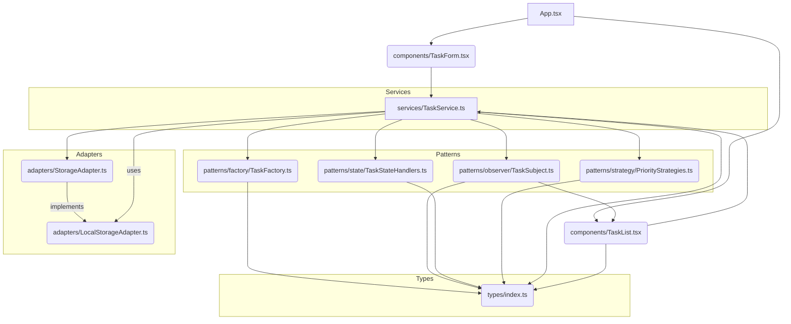
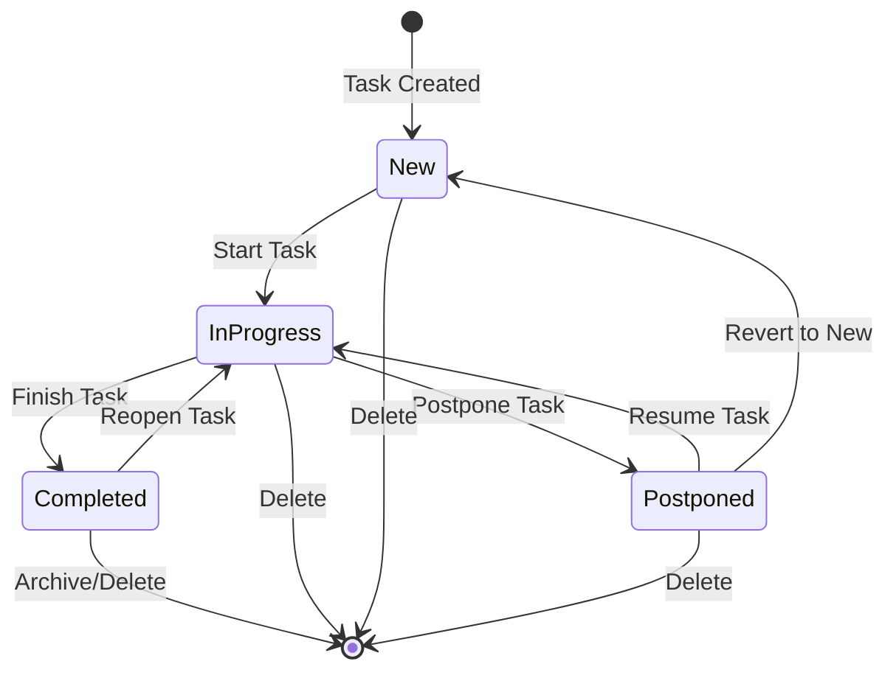

# Design Documentation for To-Do List Application

This document outlines the design decisions, architectural patterns, and principles applied in the To-Do List application to ensure its flexibility, extensibility, and maintainability.

## 1. Design Patterns Used

We have strategically implemented five key design patterns to manage complexity and promote a robust architecture:

### 1.1. State Pattern

**Purpose**: To allow an object to alter its behavior when its internal state changes. The object will appear to change its class.

**Implementation**: In our To-Do List, the `Task` object's state (NEW, IN_PROGRESS, COMPLETED, POSTPONED) is managed by distinct state handler classes (`NewStateHandler`, `InProgressStateHandler`, `CompletedStateHandler`, `PostponedStateHandler`). The `TaskService` delegates state-specific behavior to the current state handler, making state transitions explicit and extensible.

**Benefits**: 
*   **Decoupling**: The logic for each state is encapsulated in a separate class, reducing conditional logic within the `Task` or `TaskService`.
*   **Extensibility**: Adding new task states requires creating a new handler class without modifying existing state logic.
*   **Clarity**: State transitions are clearly defined, improving readability and maintainability.

### 1.2. Strategy Pattern

**Purpose**: To define a family of algorithms, encapsulate each one, and make them interchangeable. Strategy lets the algorithm vary independently from clients that use it.

**Implementation**: We use the Strategy pattern for managing task priorities (HIGH, MEDIUM, LOW). Each priority level has its own strategy class (`HighPriorityStrategy`, `MediumPriorityStrategy`, `LowPriorityStrategy`) that defines specific behaviors (e.g., `getPriorityLevel()`, `getColor()`). The `PriorityStrategyFactory` provides the correct strategy based on the `TaskPriority`.

**Benefits**: 
*   **Flexibility**: Easily add new priority levels or modify existing priority logic without affecting the core task management.
*   **Maintainability**: Specific priority rules are isolated, making them easier to understand and manage.
*   **Runtime Selection**: The appropriate strategy is chosen at runtime, allowing for dynamic behavior based on priority.

### 1.3. Factory Pattern

**Purpose**: To define an interface for creating an object, but let subclasses decide which class to instantiate. Factory Method lets a class defer instantiation to subclasses.

**Implementation**: The `ConcreteTaskFactory` is responsible for creating new `Task` objects. When a user adds a new task, the `TaskService` uses this factory to instantiate a `Task` with default properties (like `NEW` state, unique ID, and creation timestamps).

**Benefits**: 
*   **Decoupling**: The client code (`TaskService`) is decoupled from the concrete implementation details of `Task` creation.
*   **Centralized Creation**: All task creation logic is managed in one place, simplifying maintenance and ensuring consistency.
*   **Extensibility**: If the `Task` structure changes, or if different types of tasks are introduced, the changes are localized within the factory.

### 1.4. Observer Pattern

**Purpose**: To define a one-to-many dependency between objects so that when one object changes state, all its dependents are notified and updated automatically.

**Implementation**: The `TaskSubject` acts as the observable, holding the list of tasks. Components like `TaskList` act as `TaskObserver`s. When tasks are added, updated, or deleted via the `TaskService` (which uses the `TaskSubject` to manage tasks), the `TaskSubject` notifies all registered observers, prompting the UI to re-render with the latest data.

**Benefits**: 
*   **Loose Coupling**: Subject and observers are loosely coupled, allowing them to vary independently.
*   **Consistency**: Ensures that all dependent components are updated consistently when the task data changes.
*   **Modularity**: Facilitates building modular UI components that react to data changes without tight dependencies on the data source.

### 1.5. Adapter Pattern

**Purpose**: To convert the interface of a class into another interface clients expect. Adapter lets classes work together that couldn't otherwise because of incompatible interfaces.

**Implementation**: The `StorageAdapter` interface defines a contract for data storage operations. `LocalStorageAdapter` implements this interface, adapting the `localStorage` API to a generic storage interface. The `TaskService` depends on the `StorageAdapter` interface, not directly on `localStorage`.

**Benefits**: 
*   **Interoperability**: Allows `TaskService` to work with different storage mechanisms (e.g., IndexedDB, a backend API) by simply providing a new adapter implementation.
*   **Flexibility**: The storage mechanism can be swapped out without modifying `TaskService` logic.
*   **Testability**: Easier to mock the storage layer for unit testing of `TaskService`.

## 2. Design Principles Used

We adhere to fundamental design principles to ensure a clean and maintainable codebase:

### 2.1. Single Responsibility Principle (SRP)

**Definition**: A class should have only one reason to change.

**Application**: 
*   `TaskService` focuses solely on task business logic (creating, updating, deleting, changing state) and managing the task collection, delegating storage to `StorageAdapter` and state handling to `TaskStateHandlers`.
*   `TaskFactory` is only responsible for creating `Task` objects.
*   Each `TaskStateHandler` is responsible only for handling a specific task state.
*   Each `PriorityStrategy` is responsible only for defining the behavior of a specific priority level.

### 2.2. Open/Closed Principle (OCP)

**Definition**: Software entities (classes, modules, functions, etc.) should be open for extension, but closed for modification.

**Application**: 
*   **Adding new Task States**: To add a new task state (e.g., `OnHold`), you would create a new `TaskStateHandler` class implementing `TaskStateHandler` interface without modifying existing `TaskStateHandlers` or `TaskService` (except for a new case in the `_getHandlerForState` method, which can be further abstracted with a factory for handlers).
*   **Adding new Priority Levels**: Similarly, new priority levels can be added by creating new `PriorityStrategy` implementations without altering existing strategies.
*   **Changing Storage**: By using `StorageAdapter`, the `TaskService` is closed for modification when the underlying storage mechanism changes. You just provide a new `StorageAdapter` implementation.

## 3. UML Diagrams

### 3.1. Component Diagram (Architectural Solution)



### 3.2. State Diagram for Task



## 4. Code Quality & Scalability

The application is designed with high code quality and scalability in mind:

*   **Modularity**: Clear separation of concerns (UI, services, patterns, types) ensures that changes in one area have minimal impact on others.
*   **Readability**: Consistent coding style, meaningful variable names, and comprehensive JSDoc comments make the codebase easy to understand and navigate.
*   **Extensibility**: The heavy reliance on design patterns (especially State, Strategy, and Adapter) makes it straightforward to add new features (e.g., new task states, new priority types, different storage backends, deadlines, categories) without significant refactoring of existing core logic.
*   **Maintainability**: Decoupling and clear responsibilities reduce the likelihood of introducing bugs and simplify debugging.

## 5. Testing

Unit tests are provided for core components and design pattern implementations. These tests ensure:
*   Correct behavior of `TaskFactory` in creating tasks.
*   Accurate state transitions and next/previous state logic in `TaskStateHandlers`.
*   Correct priority level and color definitions in `PriorityStrategies` and `PriorityStrategyFactory`.
*   Proper observer notification mechanism in `TaskSubject`.
*   Reliable storage operations with `LocalStorageAdapter`.
*   Comprehensive functionality of `TaskService` including task management and observer integration.

There are more than 20 unit tests, providing significant coverage of the core business logic and pattern implementations, confirming their correctness and robustness.

## 6. Sonar Metrics (Information)

To analyze code quality and test coverage metrics using SonarQube, you would typically:

1.  **Install and set up SonarQube Server**.
2.  **Install SonarScanner** on your local machine or CI/CD environment.
3.  **Run tests with coverage reporting**: Ensure your `npm test` command generates coverage reports (e.g., Jest's `coverage/lcov.info`). Jest is configured to generate coverage reports by default.
4.  **Configure `sonar-project.properties`**: Create a file named `sonar-project.properties` in your project root with configurations like:

    ```properties
    sonar.projectKey=todo-list
    sonar.projectName=To-Do List Application
    sonar.projectVersion=1.0
    sonar.sources=src
    sonar.tests=src/tests
    sonar.typescript.lcov.reportPaths=coverage/lcov.info
    sonar.testExecutionReportPaths=coverage/test-report.xml
    sonar.exclusions=**/*.test.ts, src/reportWebVitals.ts, src/react-app-env.d.ts
    ```

5.  **Run SonarScanner**: Execute the scanner command in your project root:

    ```bash
    sonar-scanner
    ```

This process would send your code, test results, and coverage data to the SonarQube server for analysis, providing detailed metrics on maintainability, reliability, security, and test coverage.

This setup allows for continuous monitoring of code quality and ensures adherence to coding standards, contributing to long-term project health. 